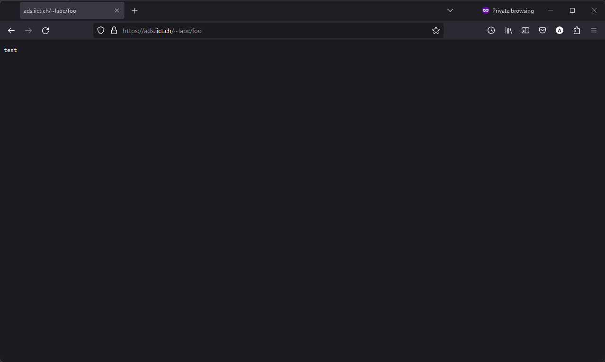
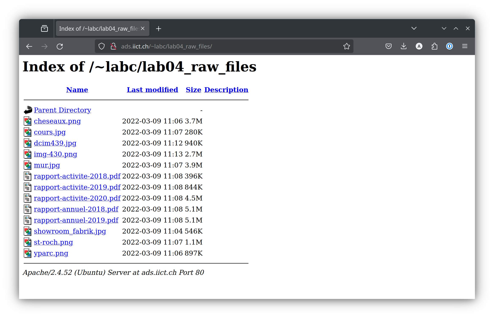

# ADS Lab 04 - Scripting
Authors : Felix Breval, Anthony David, Timothée Van HOve
Group : Lab_3_C
Date: 2024-03-24

## Task 0 (optionnal) : Install ImageMagick and Apache on your local machine
> You can do the development on the server or on your local machine. If you want to develop on your local machine do the following.
> 
>Install ImageMAgick :
> 
>```bash
> sudo apt install imagemagick
> ```
> 
>Install Apache web server :
> 
>```bash
> sudo apt install apache2
> ```
> 
>To create the same setup as on the remote machine enable the Apache `userdir` module (files in the directory `public_html` in your personal directory will be served by the web server):
> 
>```bash
> sudo a2enmod userdir
> ```
> 
>Finally restart Apache:
> 
>```bash
> sudo systemctl restart apache2
> ```
> 
>To be able to access port 80 on the guest VM from your host configure a port forwarding rule in your hypervisor (VirtualBox, VMware). Add a rule to forward, say, port 8080 on your host to port 80 on the guest.
> 
> **Transferring files between local and remote machine**
> 
>To transfer files between your local machine and the remote machine you can use the `scp` (secure copy) command that is part of SSH. `scp` works like the `cp` command except that it transfers the files over the network. It uses the SSH protocol and the authentication mechanism of SSH. In practice it means that whenever you can `ssh` into a machine, you can also copy files to it using `scp` .
> In theory you could launch `scp` on your local machine and connect to the remote machine, or run it on the remote machine and connect to your local machine. However, because your local machine is behind a NAT it is not visible from the remote machine. You can connect from the local machine to the remote, but not vice-versa. Therefore, always run scp from your local machine.
>Running `scp` on your local machine you can copy a file to the remote machine like so:
> 
> ```bash
> scp <path/to/sourcefile> <userid>@<host>:<path/to/destfile>
>```
> 
> Where
> 
>- `<path/to/sourcefile> is the file on your local machine you want to copy
> - `<userid>` is your user id on the remote machine
>- `<host>` is the name of the remote machine
> - `<path/to/destfile>` is the destination of the file on the remote machine
> 
> To do the opposite, i.e. copy a file from the remote machine to the local machine:
> 
>```bash
> scp <userid>@<host>:<path/to/srcfile> <path/to/dstfile>
>```

## Task 1 : Set up web directory

> On the server ads.iict.ch we have set up a web server. You can make files available through this server by creating directory named public_html in your home directory. If you place a file named filename in that directory it will be available on the web server under the URL http://ads.iict.ch/~albert_einstein/filename (replace
> albert_einstein with your user id).
>
> 1. Create the directory public_html. Create a file foo.txt in it and retrieve the file using the browser on your local machine.

**Commands : **

```bash
labc@ads:~$ mkdir public_html
labc@ads:~$ cd public_html/
labc@ads:~/public_html$ nano foo.txt
```

In the file "foo.txt", we just write "test".

> 2. Navigate to the URL http://ads.iict.ch/~albert_einstein/foo.txt. You should see the contents of the file.



## Task 2 : Create thunmbnails

> 1. Download a zip archive containing the picture and brochure files from this URL: http://ads.iict.ch/lab04_raw_files.zip Use the commands curl to download and unzip to unarchive.
>
>    By placing the files into your web directory you can inspect them using your
>    browser.



> 2. Display the dimensions of a few pictures by using ImageMagick's identify command. This command has a powerful feature where one can specify a format string (similar to the printf() format string in C) that specifies the information to print.
>
>    ```bash
>    identify -format 'width: %w, height: %h' picture.jpg
>    ```

```bash
labc@ads:~/public_html/lab04_raw_files$ identify -format 'width: %w, height: %h\n' cheseaux.png
width: 2500, height: 1667
labc@ads:~/public_html/lab04_raw_files$ identify -format 'width: %w, height: %h\n' cours.jpg
width: 2500, height: 1667
labc@ads:~/public_html/lab04_raw_files$ identify -format 'width: %w, height: %h\n' dcim439.jpg
width: 1200, height: 867
labc@ads:~/public_html/lab04_raw_files$ identify -format 'width: %w, height: %h\n' img-430.png
width: 1920, height: 858
labc@ads:~/public_html/lab04_raw_files$ identify -format 'width: %w, height: %h\n' showroom_fabrik.jpg
width: 3456, height: 4608
labc@ads:~/public_html/lab04_raw_files$ identify -format 'width: %w, height: %h\n' st-roch.png
width: 1200, height: 800
labc@ads:~/public_html/lab04_raw_files$ identify -format 'width: %w, height: %h\n' yparc.png
width: 1200, height: 800
```

Note : To improve readability, we've added a line break at the end of each string format. This has no other impact.

> 3. Write a script called show_dimensions that loops through all the picture files and shows for each its name and its dimensions. For the loop use the for `.. in .. do ..` done control structure.
>
>    Assumptions:
>
>    - The script is launched with public_html as the current directory.
>    - The picture files are in the directory public_html/lab04_raw_files .
>
>    **Deliverable: script show_dimensions**

**Script "show_dimensions" :**

```bash
labc@ads:~/public_html$ cat show_dimensions
#!/bin/bash

# Chemin vers le répertoire contenant les images
DIRECTORY="./lab04_raw_files"

# Extension des fichiers à traiter
declare -a EXTENSIONS=("jpg" "jpeg" "png")

# Boucle à travers tous les fichiers dans le répertoire
for IMAGE in $DIRECTORY/*; do
    if [[ -f $IMAGE ]]; then
        # Extraction de l'extension du fichier
        EXTENSION="${IMAGE##*.}"
        EXTENSION="${EXTENSION,,}" # Convertir en minuscules pour la comparaison

        # Vérifier si le fichier est une image
        if [[ " ${EXTENSIONS[@]} " =~ " ${EXTENSION} " ]]; then
            # Obtention des dimensions de l'image avec 'identify'
            DIMENSIONS=$(identify -format ' width: %w, height: %h\n'  "$IMAGE")
            # Affichage du nom du fichier et de ses dimensions
            echo "$(basename "$IMAGE"): $DIMENSIONS"
        fi
    fi
done

```

**Output :**

```bash
labc@ads:~/public_html$ bash show_dimensions
cheseaux.png: width: 2500, height: 1667
cours.jpg: width: 2500, height: 1667
dcim439.jpg: width: 1200, height: 867
img-430.png: width: 1920, height: 858
mur.jpg: width: 2501, height: 1667
showroom_fabrik.jpg: width: 3456, height: 4608
st-roch.png: width: 1200, height: 800
yparc.png: width: 1200, height: 800
```

> 4. Write a script called `rename_pictures` that produces picture files that have the dimensions in their name. For example if a picture is called building.jpg and has a width of 1024 and a height of 768 pixels the script should create a file building_1024_768.jpg . The script should not modify the original files,
>    but create new ones.
>
>    When you run the script several times how do you prevent the dimensions from accumulating in the name, like `building_1024_768_1024_768_1024_768.jpg` ? The orginal files can be named anything. They could have the dimensions in the file name accidentally. Change the script and/or the organization of the files so that the dimensions don't accumulate ad infinitum. Put a comment into the script explaining how you did it. Hint: There is a very simple solution. Analyzing the filename is way too complicated.
>
>    Assumptions: like for the previous script
>
>    **Deliverable: script rename_pictures**

**Output :**

```bash
labc@ads:~/public_html$ bash rename_pictures
Fichier créé : ./lab04_raw_files/cheseaux_2500_1667.png
Fichier créé : ./lab04_raw_files/cours_2500_1667.jpg
Fichier créé : ./lab04_raw_files/dcim439_1200_867.jpg
Fichier créé : ./lab04_raw_files/img-430_1920_858.png
Fichier créé : ./lab04_raw_files/mur_2501_1667.jpg
Le fichier rapport-activite-2018.pdf est ignoré car son extension n'indique pas une image.
Le fichier rapport-activite-2019.pdf est ignoré car son extension n'indique pas une image.
Le fichier rapport-activite-2020.pdf est ignoré car son extension n'indique pas une image.
Le fichier rapport-annuel-2018.pdf est ignoré car son extension n'indique pas une image.
Le fichier rapport-annuel-2019.pdf est ignoré car son extension n'indique pas une image.
Fichier créé : ./lab04_raw_files/showroom_fabrik_3456_4608.jpg
Fichier créé : ./lab04_raw_files/st-roch_1200_800.png
Fichier créé : ./lab04_raw_files/yparc_1200_800.png
labc@ads:~/public_html$ bash rename_pictures
Le fichier cheseaux_2500_1667.png contient déjà des dimensions dans son nom.
Fichier créé : ./lab04_raw_files/cheseaux_2500_1667.png
Le fichier cours_2500_1667.jpg contient déjà des dimensions dans son nom.
Fichier créé : ./lab04_raw_files/cours_2500_1667.jpg
Le fichier dcim439_1200_867.jpg contient déjà des dimensions dans son nom.
Fichier créé : ./lab04_raw_files/dcim439_1200_867.jpg
Le fichier img-430_1920_858.png contient déjà des dimensions dans son nom.
Fichier créé : ./lab04_raw_files/img-430_1920_858.png
Le fichier mur_2501_1667.jpg contient déjà des dimensions dans son nom.
Fichier créé : ./lab04_raw_files/mur_2501_1667.jpg
Le fichier rapport-activite-2018.pdf est ignoré car son extension n'indique pas une image.
Le fichier rapport-activite-2019.pdf est ignoré car son extension n'indique pas une image.
Le fichier rapport-activite-2020.pdf est ignoré car son extension n'indique pas une image.
Le fichier rapport-annuel-2018.pdf est ignoré car son extension n'indique pas une image.
Le fichier rapport-annuel-2019.pdf est ignoré car son extension n'indique pas une image.
Le fichier showroom_fabrik_3456_4608.jpg contient déjà des dimensions dans son nom.
Fichier créé : ./lab04_raw_files/showroom_fabrik_3456_4608.jpg
Le fichier st-roch_1200_800.png contient déjà des dimensions dans son nom.
Fichier créé : ./lab04_raw_files/st-roch_1200_800.png
Le fichier yparc_1200_800.png contient déjà des dimensions dans son nom.
Fichier créé : ./lab04_raw_files/yparc_1200_800.png
```

> 5. With a few pictures try to create a smaller thumbnail where the largest side is 300 pixels. Use ImageMagick's convert command like so:
>
>    ```bash
>    convert -geometry 300 picture.jpg picture_thumb.jpg
>    ```

**Output :**

```bash
labc@ads:~/public_html/lab04_raw_files$ convert -geometry 300 cheseaux.png cheseaux_thumb.png
labc@ads:~/public_html/lab04_raw_files$ identify -format 'width: %w, height: %h' cheseaux_thumb.png
width: 300, height: 200
```


> 6. Write a script called make_thumbnails that loops through all the picture files and creates a thumbnail for each. If the picture file is named building.jpg the corresponding thumbnail should be named building_thumb.jpg.
>
>    When you run the script several times how do you prevent making thumbnails from
>    thumbnails? Add a comment to the script explaining your solution.

// todo

> 7. With a few PDF files try to create a thumbnail. In contrast to pictures PDF documents can have several pages. One needs to specify to the convert command that only the first page should be processed. This is done by appending the string [0] to the filename like so (no space between the two):
>
>    ```
>    convert -geometry 300 document.pdf[0] document_thumb.jpg
>    ```
>
>    Since the latest versions of ImageMagick, PDF conversion is disabled by default for security reasons. Automated conversion of PDF documents provided by visitors, e.g. uploaded on a website, can cause the execution of malicious code contained in the PDF.
>
>    To reactivate this feature, you must comment out the `<policy domain="coder" rights="none" pattern="PDF" />` line at the end of the `/etc/ImageMagick-6/policy.xml` file

// todo

> 8. Improve the script so that it generates thumbnails for both pictures and PDFdocuments.
>
>    **Deliverable: the final make_thumbnails script**

## Task 3 : Generate HTML file

> In this task you will write a script that produces the HTML file. The webmaster hascreated a template for the pages of the website. It is available here : http://ads.iict.ch/lab04_template.zip.
>
> The template page is provided in 2 versions, HTMP and PHP. For this task both versions can be used without real difference. The PHP version will be needed for the last task of this lab, you have the following choices : * Working with index.html file in this task. For the next task you'll upload both generated index.html and index.php (renamed  for example to task4.php) * Working directly with index.php in this task and ignore
> index.html.
>
> The HTML code can be divided into three pieces: a beginning, a middle and an end. Onlythe middle piece depends on the pictures and brochures, the beginning and end arealways the same. Thus the script has only to produce the middle piece, and can simplycopy the beginning and end from two files.
>
> The middle should have the following structure:
>
> ```html
> <article class="container article">
>     <div class="row">
>         <div class="col-md-10 col-md-pull-3 col-md-offset-4 article__content">
>             <div>
>                 <div><h2>Découvrez-nous en images</h2></div>
>             </div>
>             <div class="row">
>                 <div class="col-md-6 col-xs-12">
>                     <a href="files/cheseaux.png"></a>
>                 </div>
>                 <div class="col-md-6 col-xs-12">
>                     <a href="files/cours.png"></a>
>                 </div>
>                 <!-- Add more elements here if needed -->
>             </div>
>         </div>
>     </div>
> 
>     <div class="row" style="margin-top: 40px;">
>         <div class="col-md-10 col-md-pull-3 col-md-offset-4 article__content">
>             <div>
>                 <div><h2>Téléchargez nos brochures</h2></div>
>             </div>
>             <div class="row">
>                 <div class="col-md-6 col-xs-12">
>                     <a href="files/rapport-activite-2018.pdf"></a>
>                 </div>
>                 <div class="col-md-6 col-xs-12">
>                     <a href="files/rapport-activite-2019.pdf"></a>
>                 </div>
>                 <!-- Add more elements here if needed -->
>             </div>
>         </div>
>     </div>
> </article>
> 
> ```
>
> 1.  Download the HTML template and using a text editor create two files called template_begin.html and `template_end.html` containing the fixed beginning and end of the template.

// todo

> 2.  Write a script called make_html that produces the HTML for the middle.
>
>    Assumptions:
>
>    - The script is launched with `public_html `as the current directory.
>    - The picture files are in the directory `public_html/raw_files`.
>    - The script writes the HTML file to the directory `public_html`.

// todo

> 3. Extend the script so that it produces a single HTML file called page.html in your web directory public_html . When viewed with a browser, the URL http://ads.lan.iict.ch/~albert_einstein/page.html should show the complete page with clickable pictures and brochures.
>
>    **Deliverable: the final `make_html` script**

## Task 4 : Use SSH tunneling

> For this last task we will use the SSH client to setup a port redirection allowing us connect remotely a database management tool (such as MySQL-Workbench) to the MariaDB database on the server. The database is reachable on port 3306 which is not open in the firewall and accepts only local connection. Ignore the presence of phpmyadmin on this server.
>
> The index.php page has a "dynamic" menu loaded from a table named "menu" which contains the different navigation levels. This page doesn't respect best practices relating to PHP development or security, its sole purpose is to be used as a tool to illustrate this task.
>
> 1. Edit the page index.php with your username and MariaDB password. To avoid conflict with index.html, you can rename index.php to something.php

// todo

> 2. Install locally (not on the server) a database management tool Hint: snap install mysql-workbench-community , you may have to allow access to password storage from Ubuntu software

// todo

> 3. Use SSH to redirect remote port 3306 to a local on, you can choose any port number above 1024 .

// todo

> 4. Connect database management tool to the database. Display the menu table and perform some modifications that should be visible when you refresh the index.php page in your browser.
>
>    **Deliverable: the SSH command you use and a screenshot of the database management toolshowing the database**

// todo